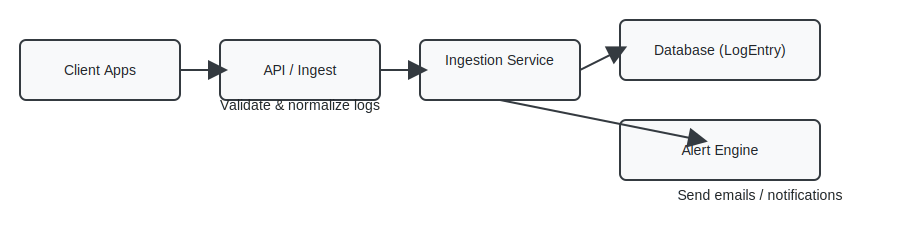

# AI Log Monitoring & Alert System

## Project Overview
This project is a log monitoring system that collects application logs,
stores them in a database, detects issues, and sends alerts.

# AI Log Monitoring & Alert System

## Project Overview
This project is a log monitoring system that collects application logs,
stores them in a database, detects issues, and sends alerts.

It includes:
- Log ingestion API
- Database storage
- Alert system
- Dashboard views

---

## Requirements

Make sure these are installed:

- Python 3.10+
- pip
- virtualenv (or use venv)
- Docker & Docker Compose (optional, recommended for production-like runs)
- PostgreSQL (optional; project ships with SQLite default)

---

## Quick Start — Run locally (Windows PowerShell)

1. Create and activate a virtual environment

```powershell
python -m venv .venv
.\.venv\Scripts\Activate.ps1
```

2. Install dependencies

```powershell
pip install -r requirements.txt
```

3. Apply migrations

```powershell
python manage.py migrate
```

4. (Optional) Create a superuser

```powershell
python manage.py createsuperuser
```

5. Run the development server and open the app in your browser

```powershell
python manage.py runserver
# Open http://127.0.0.1:8000 in your browser
```

If using the bundled Docker Compose setup the app will be available at http://127.0.0.1:8090 by default (see Docker section).

---

## Testing

- Run Django's tests locally:

```powershell
python manage.py test
```

- To run tests for the `ingestion` app only:

```powershell
python manage.py test ingestion
```

---

## Docker (Build & Run)

This repository includes a `Dockerfile` and `docker-compose.yml` configured with a `web` service and a `db` Postgres service.

- Build and run with Compose (recommended):

```powershell
# from repo root
docker compose up --build
```

This will build the `web` image and start both the `web` and `db` containers. The Django dev server listens on port 8000 inside the container and is mapped to host port 8090 — open http://127.0.0.1:8090 in your browser.

- Run migrations inside the container:

```powershell
docker compose run --rm web python manage.py migrate
```

- Run tests inside the container:

```powershell
docker compose run --rm web python manage.py test
```

---

## Browser / UI quick notes

- Dashboard and views are available at the root app URLs; visit `/` after starting the server.
- Use `/admin` to log into the Django admin and inspect `LogEntry` and `Alert` objects.

---

## Flow diagram

Below is a visual flow diagram of the core data path. (SVG file is included at `docs/flow.svg`.)



---

## Troubleshooting

- If you see database connection errors when using Docker, ensure the `db` service finished starting before running migrations.
- For local runs using SQLite there is no DB setup required beyond `migrate`.
- If port 8090 (Docker) or 8000 (local) is in use, change the mapped port in `docker-compose.yml` or pass a port to `runserver`.

---

## Useful files

- `manage.py` — Django CLI entrypoint
- `ingestion/models.py` — `LogEntry` and `Alert` models
- `docker-compose.yml` — Compose orchestration (services: `web`, `db`)
- `Dockerfile` — Image build for `web` service

If you'd like I can also add a quick `Makefile` or PowerShell script to automate the common developer tasks.
